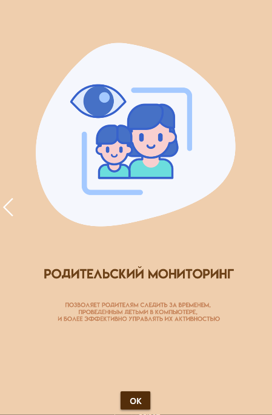

# ‍👩‍👧‍👦 Родительский контроль (версия для персонального компьютера)

**Название приложения**

Healthy Kids

**Описание**

**Healthy Kids** — это удобное и надежное приложение, разработанное с использованием технологий Flutter и WPF, которое предоставляет родителям полный контроль над детским компьютером. Данное приложение работает в паре с мобильным устройством и персональным компьютером, и обеспечивает удобный интерфейс для мониторинга и управления активностью ребенка.
С удобным интерфейсом и надежной связью с персональным компьютером, это приложение становится незаменимым помощником для семей, стремящихся обеспечить здоровое и безопасное использование технологий своими детьми.

**Основные функции**

•	Сплеш-скрин - при запуске приложения на компьютере отображается стильный сплеш-скрин с логотипом приложения, создающий первое впечатление для пользователей.

•	Отображение в таск-баре - приложение появляется в системном трее компьютера, обеспечивая легкий доступ к его функциональности и уведомлениям.

•	Генерация уникального UID - для обеспечения безопасной и надежной связи между мобильным устройством и компьютером, приложение на ПК генерирует уникальный идентификатор (UID) для каждого компьютера. Этот UID используется для установления связи с мобильным приложением.

•	Блокировка процессов по истечении времени - пользователь мобильного приложения может установить ограничение по времени для использования компьютера своим ребенком. По истечении заданного времени приложение на ПК автоматически блокирует все активные процессы на компьютере.

•	Тест-капча для разблокировки - для разблокировки компьютера после блокировки пользователю необходимо пройти тест-капчу. На весь экран выводится текстовое или графическое задание, на которое нужно правильно ответить. Если ответы верны, приложение позволяет продолжить работу.

•	Формирование ежедневных отчетов - приложение на ПК автоматически формирует отчет о компьютерной активности ребенка, включая информацию о времени, проведенном на компьютере, использованных приложениях. Этот отчет отправляется на мобильное устройство родителя ежедневно.

## 📸 Скриншоты

| 1 | 2|
|------|-------|
|||

| 3 | 4|
|------|-------|
|||

| 5 |
|------|
||

## ⚒️ Технические требования
* Операционная система - Windows
* ОЗУ - 4 Гб
* Процессор - Intel Core i3-2340UE или AMD A9-9420
* Доступ к интернету
* Свободное место на жёстком диске - 1 Гб
  

## 💫 Средства разработки
- Microsoft Visual Studio
- WPF и C#
